# Smart Library Table Reservation & IoT Monitoring

This project is an INTI Capstone that combines a web-based library table reservation system with IoT occupancy monitoring. Students, lecturers, and visitors can browse a virtual multi-floor library map, reserve tables in fixed time slots during library hours, and check in at the table using an OTP sent by email. On the hardware side, weight sensors detect whether a seat is actually occupied, while LCD displays show entrance availability counts and per-table status or countdown. Admins oversee the full system from a dedicated console: user directories, table layouts, reservation history, weight sensors, and LCD devices.

The goal is to reduce wasted seats from abandoned bookings, give library users a clearer view of free tables before they arrive, and give librarians real-time visibility into both bookings and physical occupancy. The web app handles account roles, booking rules (opening hours, slot length, overlap checks, and a daily reservation-time limit), and email reminders. The IoT layer connects weight sensors and LCD units so the digital map stays closer to what is happening in the real library space.

## Members

|  | 
|:---:|:---:|
| [LinThit](https://github.com/LinThitHtwe)  | [Yuka](https://github.com/Yuka2608)  |

## Table of Contents

- [Hardware](#hardware)
  - [IoT Top View](#iot-top-view)
  - [IoT Side View 1](#iot-side-view-1)
  - [IoT Side View 2](#iot-side-view-2)
- [User](#user)
  - [Home](#home)
  - [Homepage Seats](#homepage-seats)
  - [Homepage Seats Floor 2](#homepage-seats-floor-2)
  - [Sign In](#sign-in)
  - [Create Account](#create-account)
  - [Dashboard Home](#dashboard-home)
  - [Dashboard Home Seats](#dashboard-home-seats)
  - [Reserve Table](#reserve-table)
  - [Reserve Table Confirmation](#reserve-table-confirmation)
  - [My Reservation History](#my-reservation-history)
- [Admin](#admin)
  - [Admin Home](#admin-home)
  - [Admin Table Map](#admin-table-map)
  - [Admin Table Map Detail](#admin-table-map-detail)
  - [Admin Table Map Floor 2](#admin-table-map-floor-2)
  - [Admin Students](#admin-students)
  - [Admin Lecturers](#admin-lecturers)
  - [Admin Visitors](#admin-visitors)
  - [Admin Reservation History](#admin-reservation-history)
  - [Admin Reservation History Detail](#admin-reservation-history-detail)
  - [Admin Weight Sensors](#admin-weight-sensors)
  - [Admin Add Weight Sensor](#admin-add-weight-sensor)
  - [Admin LCD Displays](#admin-lcd-displays)
  - [Admin Add LCD Display](#admin-add-lcd-display)

## Hardware

### IoT Top View
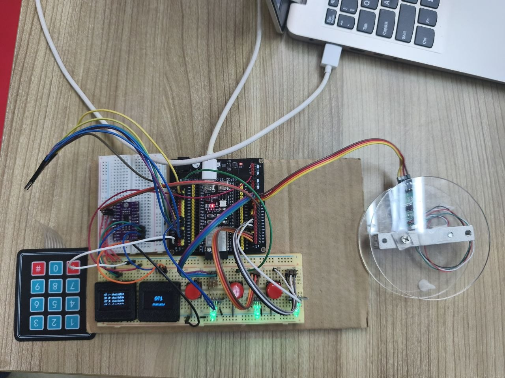

Top-down view of the smart table prototype used in this Capstone. From above you can see how the sensor and display components sit together on the table as one IoT unit. This setup is what lets the system detect occupancy on the physical seat and show local status feedback, not only in the web interface.

### IoT Side View 1
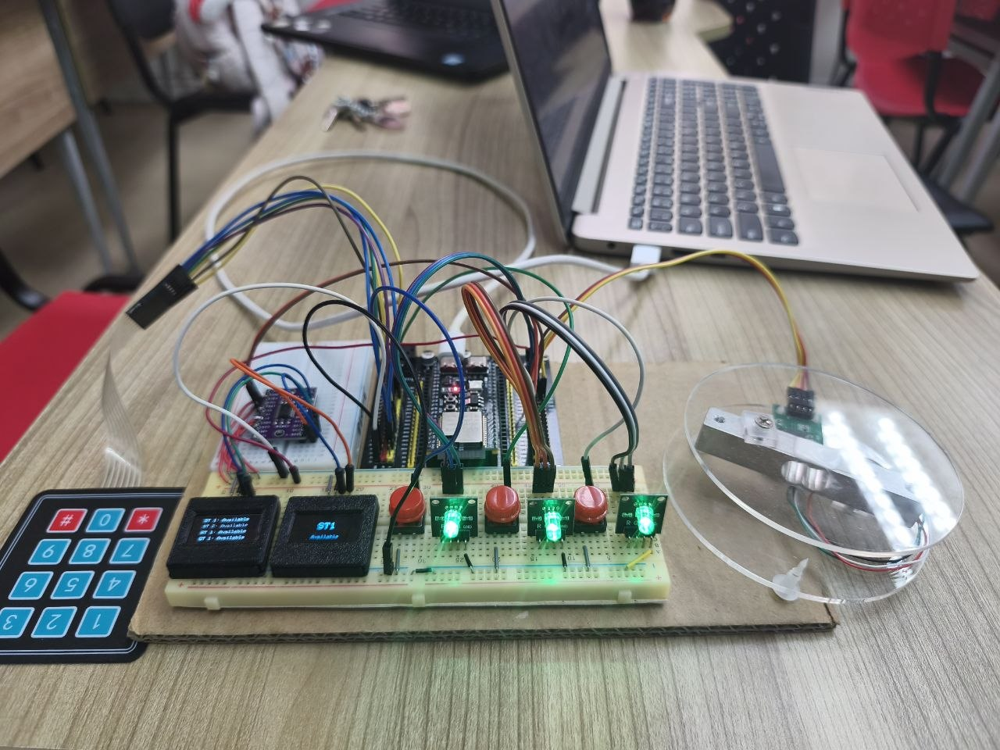

Side view of the IoT table unit. This angle highlights the physical mounting of the weight-sensing hardware and supporting electronics under or beside the table surface. Those readings are what the backend uses to decide whether a table is currently occupied, which helps keep the virtual map and reservation status closer to real library use.

### IoT Side View 2
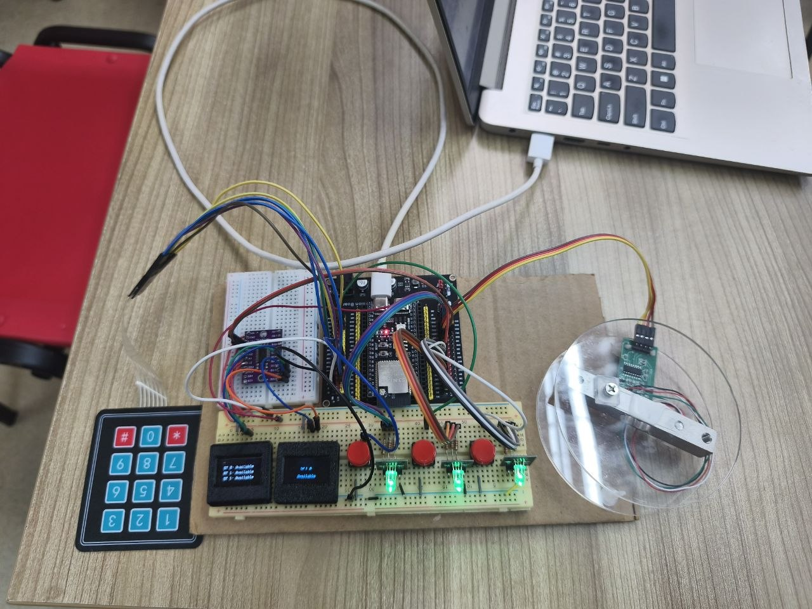

Alternate side angle of the same hardware assembly. From this view you can see how the LCD and sensor stack attach to the table so booking status and occupancy information can be shown on-site. Together with the web app, this hardware layer supports entrance availability display, per-table status, and better monitoring for librarians.

## User

### Home
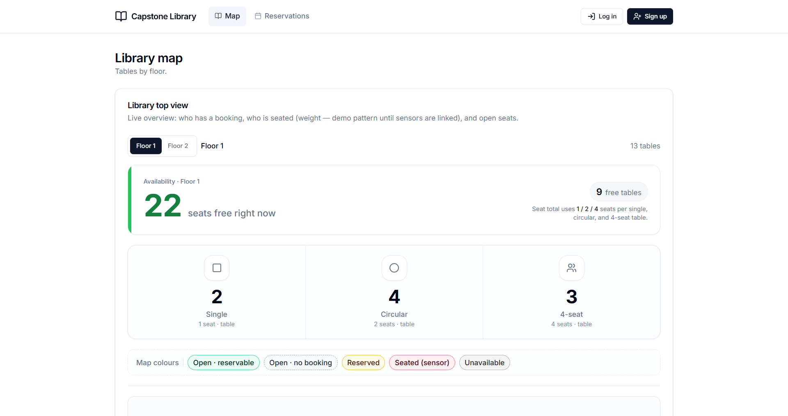

Public landing page for the library reservation system. New and returning visitors land here first to understand what the product does and where to go next. From this page they can continue into sign-in, create an account, or open the public seat map to check availability before booking.

### Homepage Seats
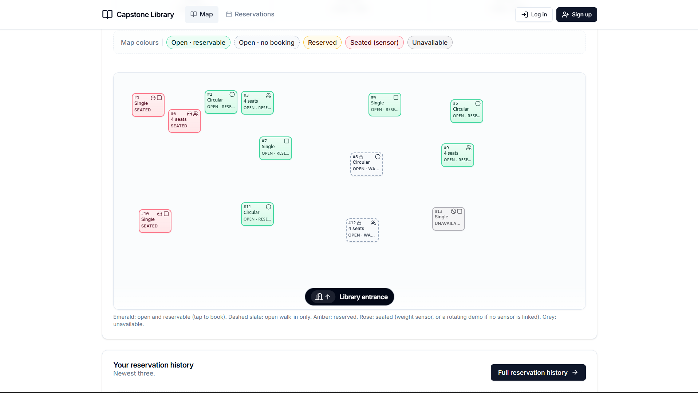

Public virtual map of library seats for a floor. Anyone can open this view without admin access to inspect table layout and live availability. It is meant to help users decide whether a floor looks busy before they sign in and reserve a specific table.

### Homepage Seats Floor 2
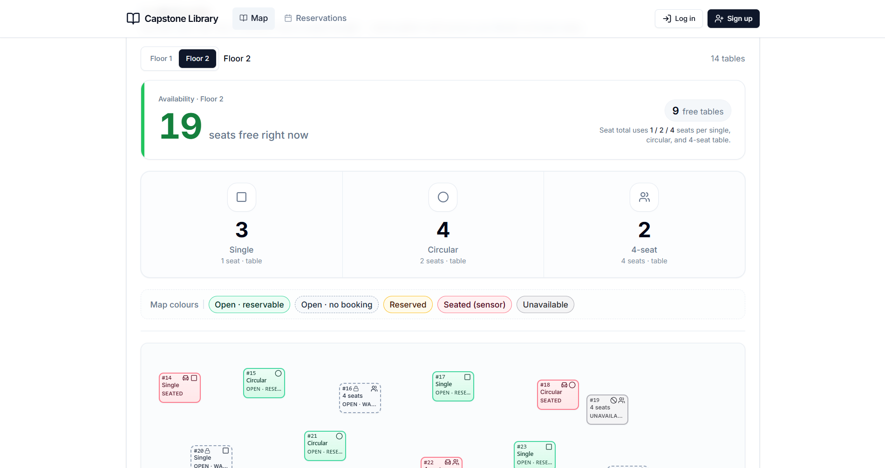

Seat map for floor 2 of the library. Users can switch floors to compare free vs occupied tables across levels and choose a better area before reserving. This multi-floor view mirrors how the real library is laid out and keeps each level’s map separate and clearer.

### Sign In
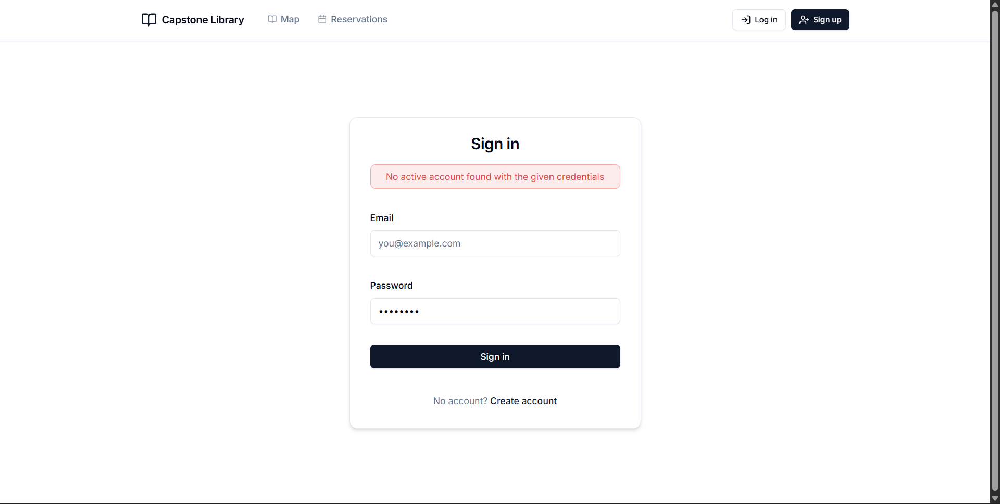

Authentication screen for existing students, lecturers, visitors, and admins. Users enter their credentials to receive access to role-specific pages. After a successful login, the app redirects library users toward booking features and admins toward the admin console, while invalid credentials are rejected without issuing a session.

### Create Account
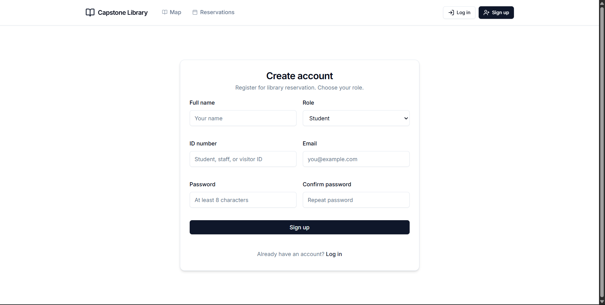

Registration form for new library users. Public roles such as student, lecturer, or visitor can sign up here so they can reserve tables later. The form collects the required account details, stores credentials securely, and blocks invalid role choices such as creating an admin account through the public sign-up flow.

### Dashboard Home
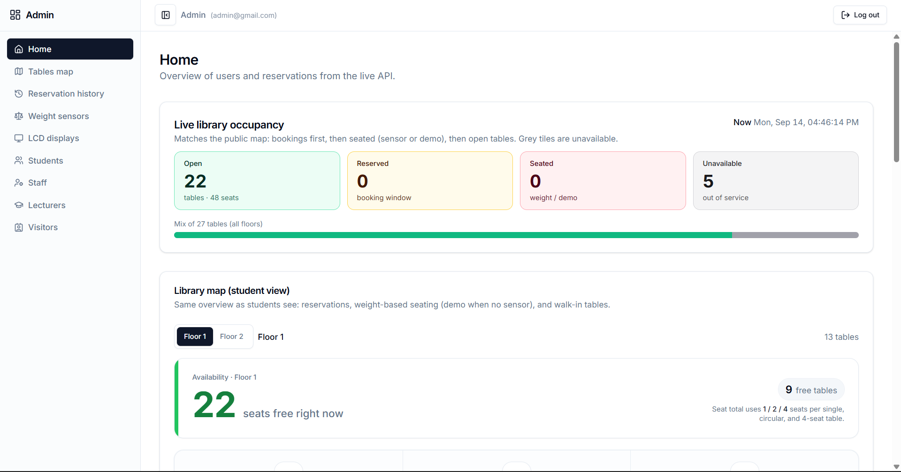

Signed-in user dashboard home. After authentication, this becomes the main hub for library users. From here they can open seat maps, start a reservation, and reach personal booking tools without needing admin privileges.

### Dashboard Home Seats
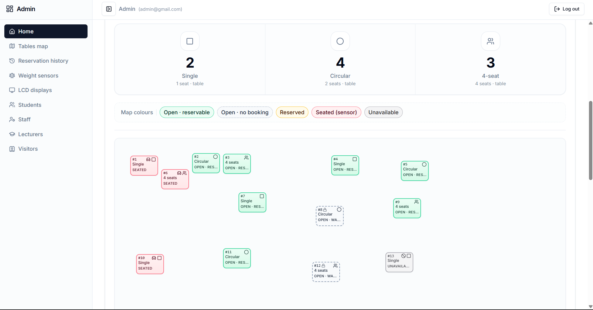

Authenticated seat overview inside the user dashboard. It shows live table status so a signed-in user can choose an available table and continue into the booking flow. Compared with the public map, this view sits inside the logged-in experience and leads more directly into reservation actions.

### Reserve Table
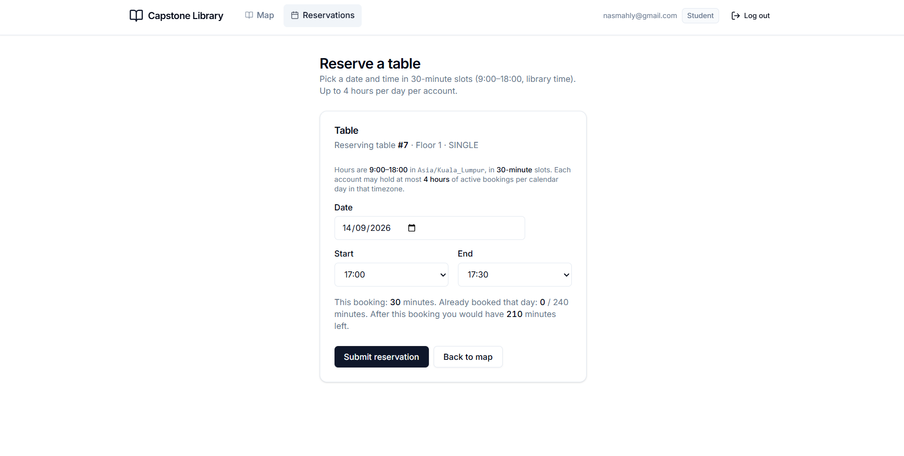

Reservation form where a user selects a table, date, and time range. Bookings follow library rules such as opening hours (for example within the configured day window), fixed slot length, no overlapping bookings on the same table, and a daily reservation-time limit. If the request breaks those rules, the system rejects it and does not create an invalid booking.

### Reserve Table Confirmation
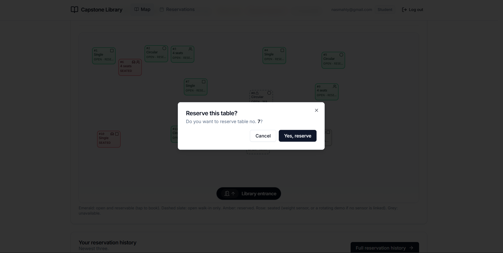

Confirmation step after a booking is submitted successfully. The system stores the reservation, generates an OTP for check-in at the table, and emails the user the booking details they need when they arrive. If email delivery fails during creation, the booking is rolled back so the database does not keep an orphan reservation.

### My Reservation History
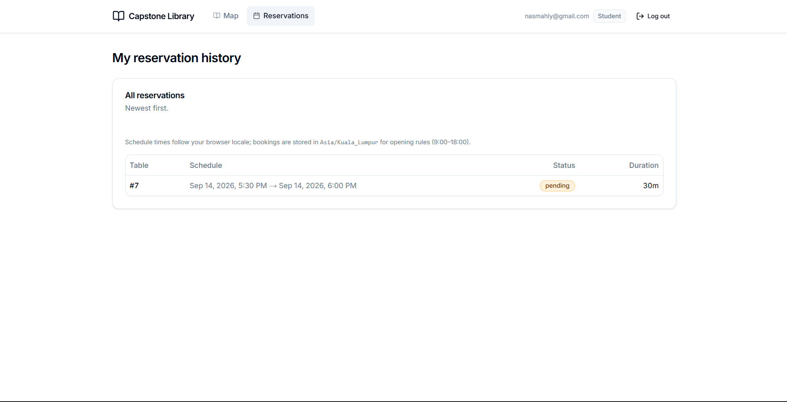

Personal reservation history for the signed-in account. Users can review their own upcoming and past bookings, including timing and status information for each record. This page is scoped to the current user only, so one account cannot see another person’s reservation list.

## Admin

### Admin Home
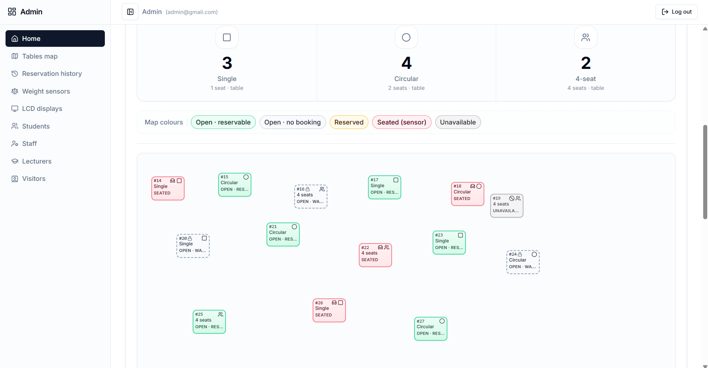

Admin console home and overview. Librarians and admins use this as the main entry point after login. From here they can jump into floor-map management, user directories, reservation oversight, weight-sensor configuration, and LCD device management for the whole library system.

### Admin Table Map
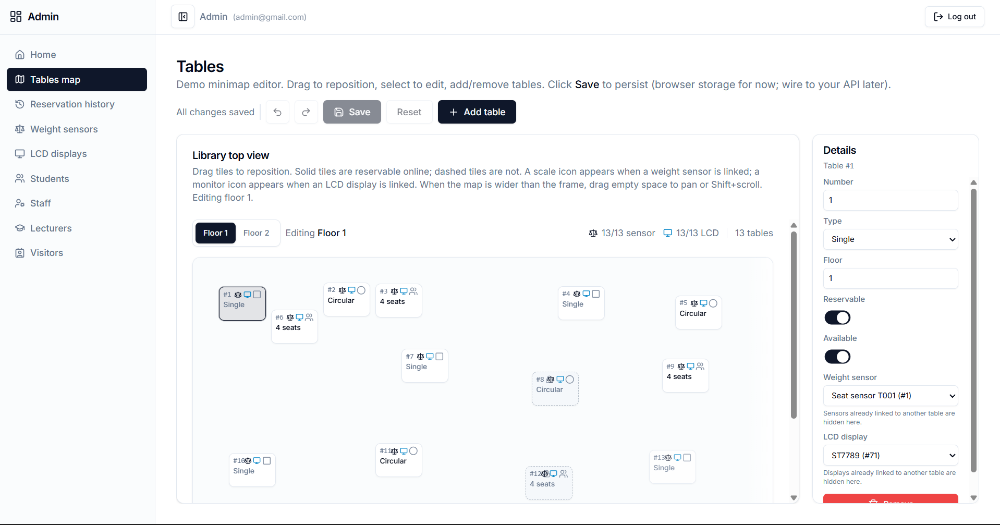

Admin virtual table map for the library layout. Admins can review table positions, floor placement, and the overall map structure used by both public and authenticated users. Keeping this map accurate is important because reservation availability and IoT status are shown against these table positions.

### Admin Table Map Detail
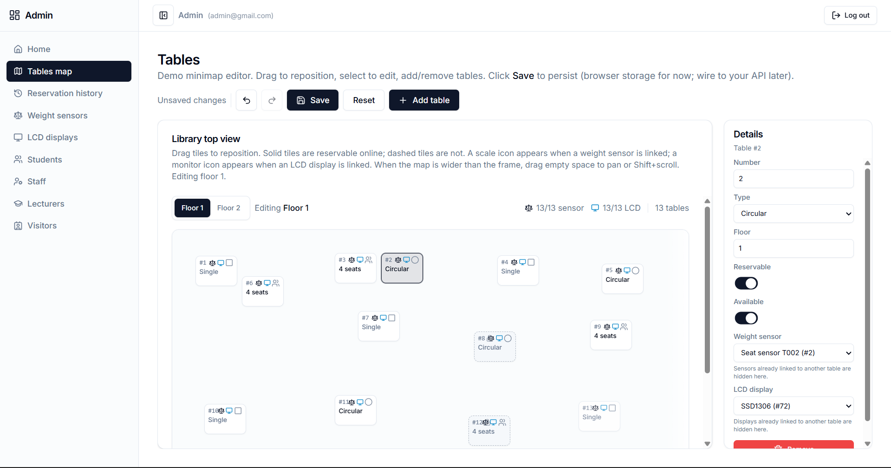

More detailed admin table-map view for inspecting or adjusting individual tables. Admins can work with placement and availability settings on the floor plan, including details that affect how reservable tables appear to users and how they link to IoT devices.

### Admin Table Map Floor 2
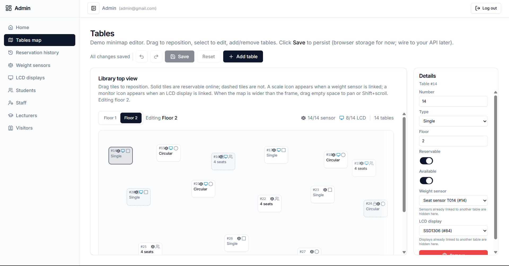

Admin map focused on floor 2. Librarians manage table layout and status for the second level separately so each floor stays accurate in the virtual map. This helps avoid mixing floor data and makes multi-level library management easier.

### Admin Students
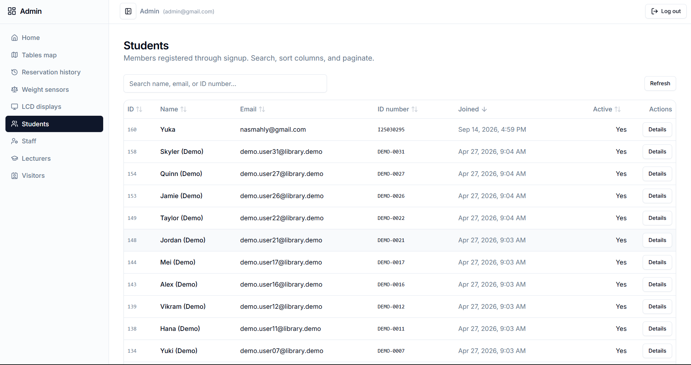

Student directory in the admin console. Admins can browse and manage student accounts that are allowed to reserve library tables. This page supports day-to-day user administration for the largest common library role in the system.

### Admin Lecturers
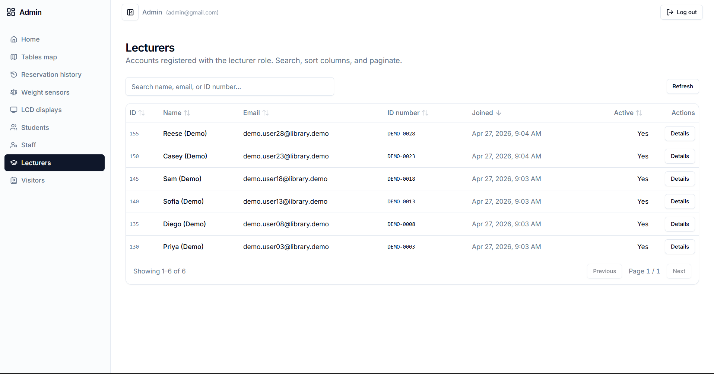

Lecturer directory for staff users. Admins use this page to review and manage lecturer accounts that can also book tables. Separating lecturers from students and visitors keeps the directory clearer when librarians need to find or update a specific role group.

### Admin Visitors
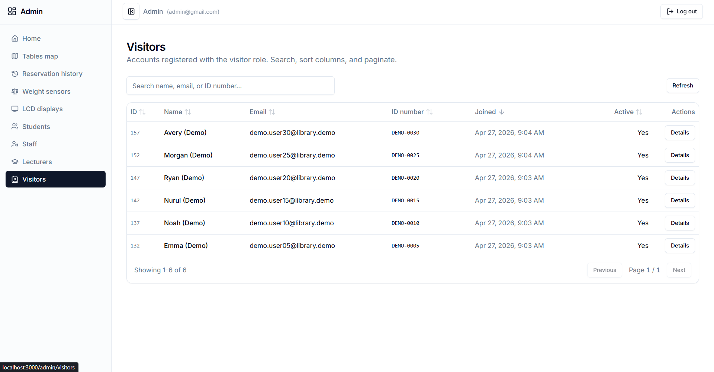

Visitor directory for non-student / non-lecturer users. Admins manage visitor accounts that still need access to reservation features. This lets temporary or external users participate in booking while remaining organized under their own role list.

### Admin Reservation History
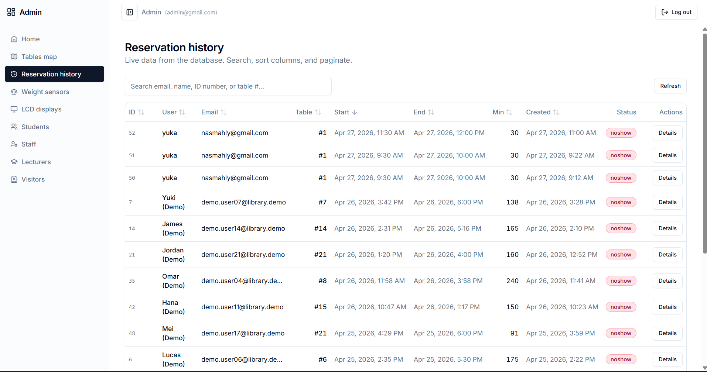

System-wide reservation history across all users and tables. Librarians use this to monitor bookings, check who reserved which seat, and oversee daily library usage. Unlike the user history page, this admin view is not limited to a single account.

### Admin Reservation History Detail
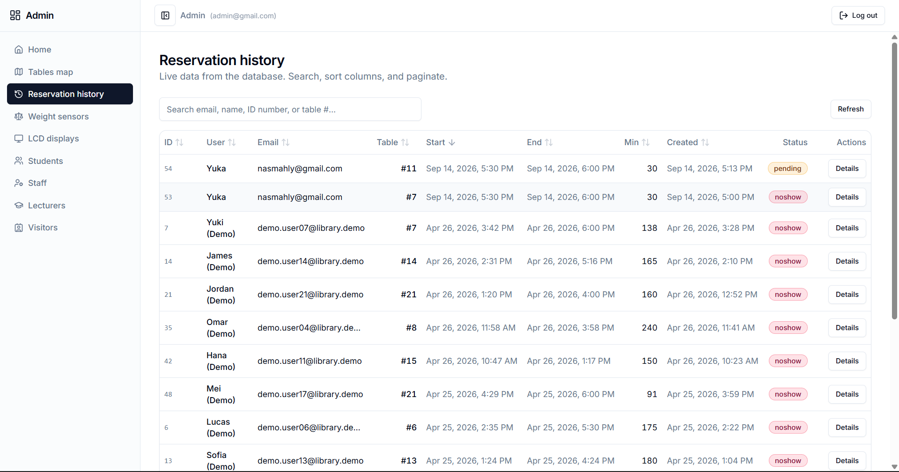

Expanded reservation history view with more booking detail. Admins can inspect individual reservation records, statuses, and related oversight information from one place. This supports deeper review when checking conflicts, overstays, reminders, or unusual booking activity.

### Admin Weight Sensors
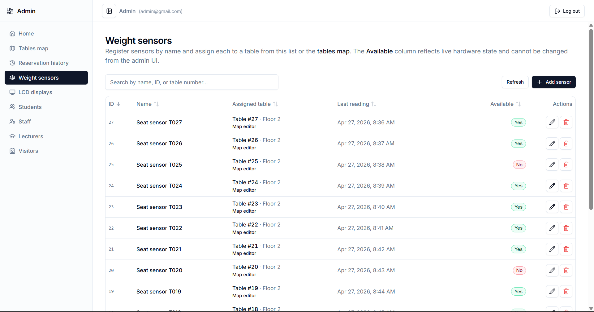

Registry of weight sensors linked to tables. These sensors detect physical occupancy and feed live occupied / free status into the reservation and map system. Admins can review the registered devices here to confirm which sensors are active and how they map to library tables.

### Admin Add Weight Sensor
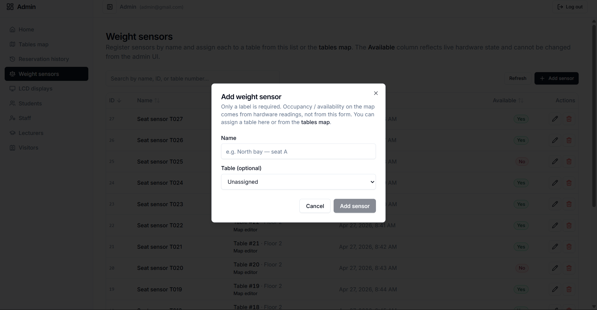

Form to register or update a weight sensor. Admins enter the required device details and link the sensor so occupancy events are tracked correctly for the related table. Validation helps reject incomplete or invalid sensor data before it is saved into the IoT configuration.

### Admin LCD Displays
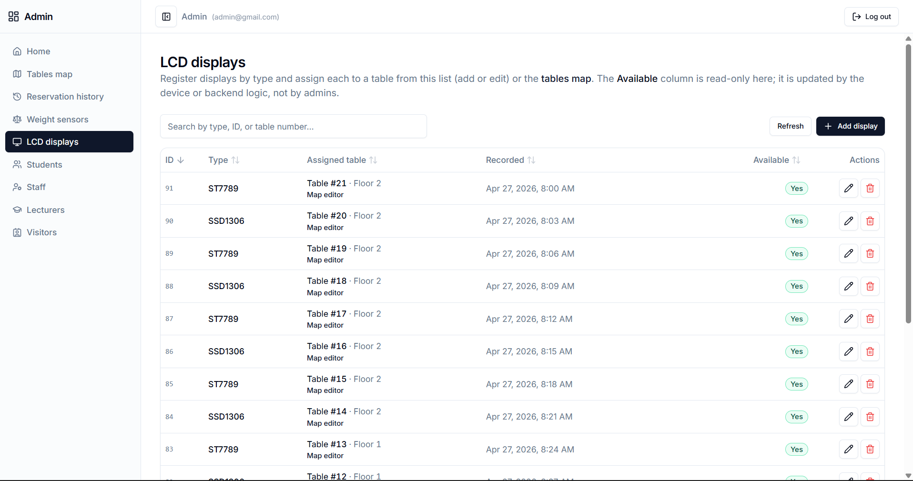

List of LCD displays managed by the system. Entrance displays can show available-seat counts for people entering the library, while table displays show booking status or countdown for that seat. Admins use this page to see which displays exist and how they are assigned.

### Admin Add LCD Display
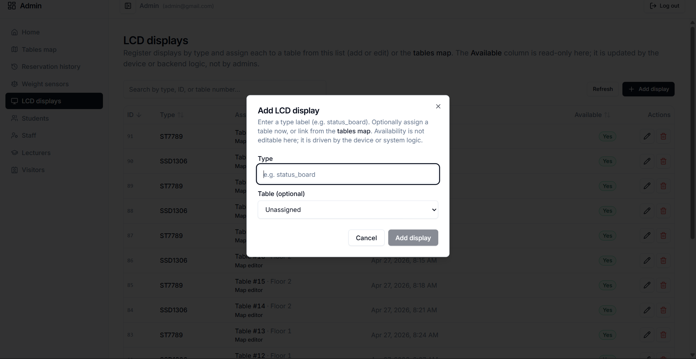

Form to add or configure an LCD display. Admins assign the display type and link it to a table or entrance role so the correct status information is shown on-site. The system expects a clear one-to-one relationship for table LCDs, which keeps each reservable table’s display mapping consistent.
